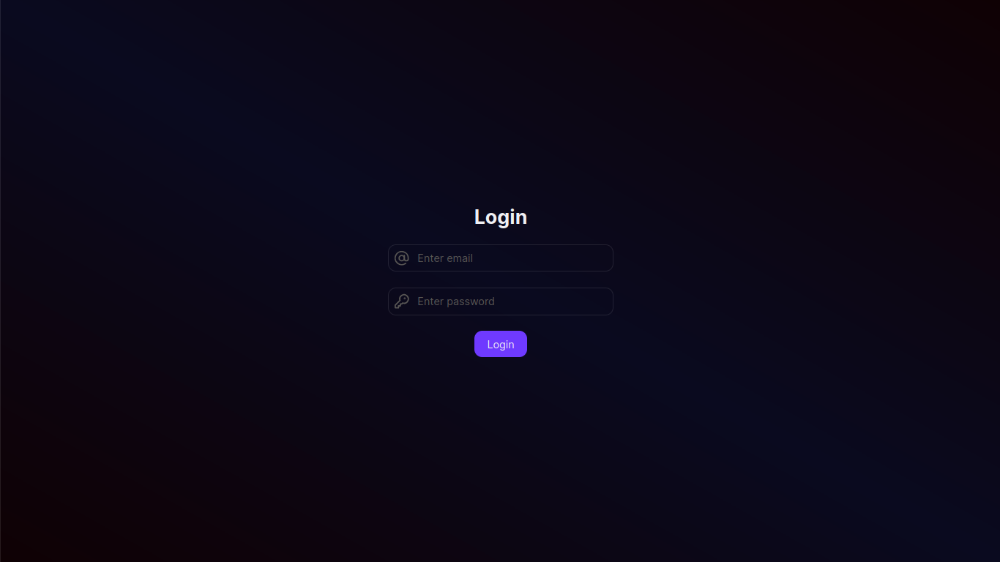
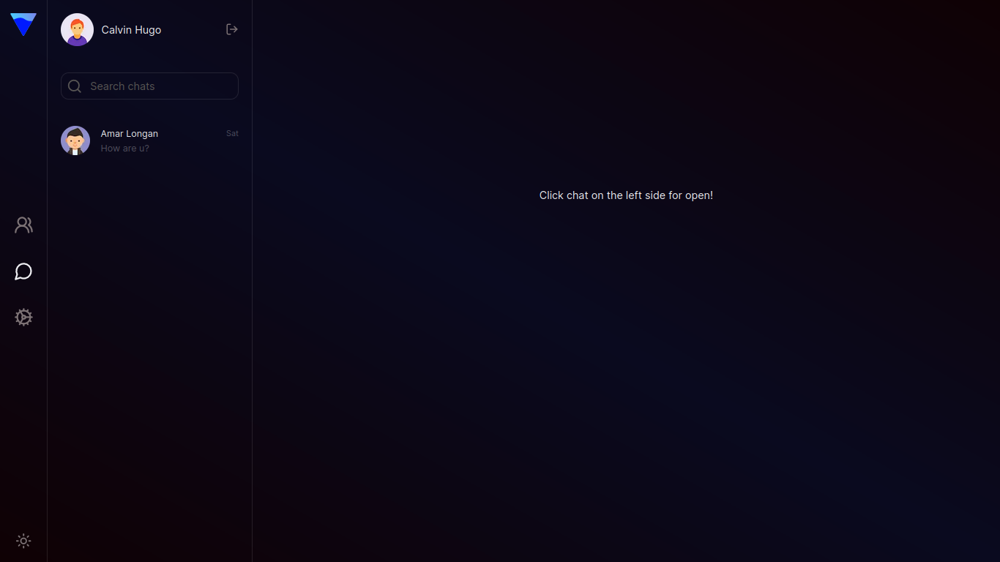
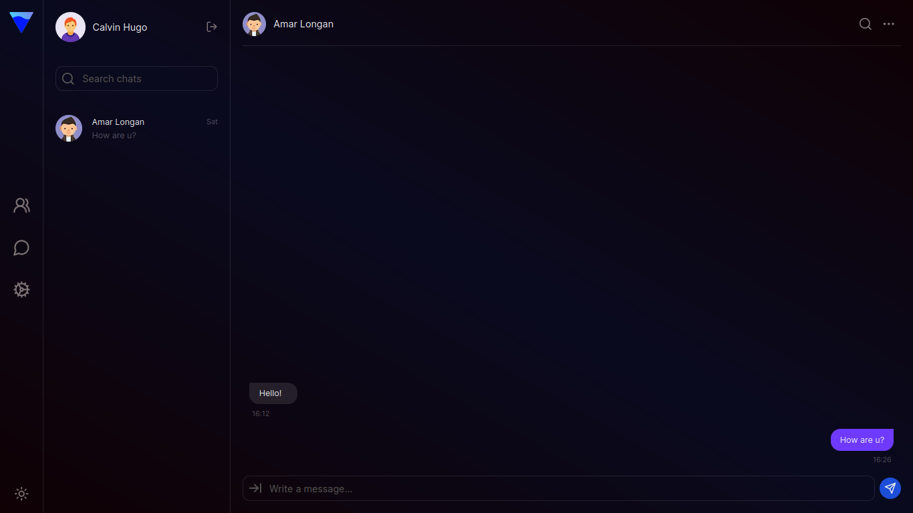

<h1 align="center">Social Network App</h1>

This is a [Next.js](https://nextjs.org/) project bootstrapped with [`create-next-app`](https://github.com/vercel/next.js/tree/canary/packages/create-next-app).

## Getting Started

First, run the development server:

```bash
npm run dev
# or
yarn dev
# or
pnpm dev
# or
bun dev
```

Open [http://localhost:3000](http://localhost:3000) with your browser to see the result.

You can start editing the page by modifying `app/page.tsx`. The page auto-updates as you edit the file.

This project uses [`next/font`](https://nextjs.org/docs/basic-features/font-optimization) to automatically optimize and load Inter, a custom Google Font.

## Stack

- React
- TypeScript
- Next.js
- Socket io
- Next-auth
- Tailwind
- Strapi

## Preview

<p align="center">
  
  
  
</p>

## Getting started with Strapi

Create a neighboring folder and run the following command:

```bash
# create back-end project
npx create-strapi-app@latest my-project

# add plugins
yarn add strapi-plugin-populate-deep
yarn add strapi-plugin-transformer
```

Go to /config/plugins.ts and copy-paste the next code:

```ts
export default ({ env }) => ({
  'transformer': {
    enabled: true,
    config: {
      responseTransforms: {
        removeAttributesKey: true,
        removeDataKey: true,
      }
    }
  },
	"strapi-plugin-populate-deep": {
		config: {
			defaultDepth: 5,
		},
	},
});

```